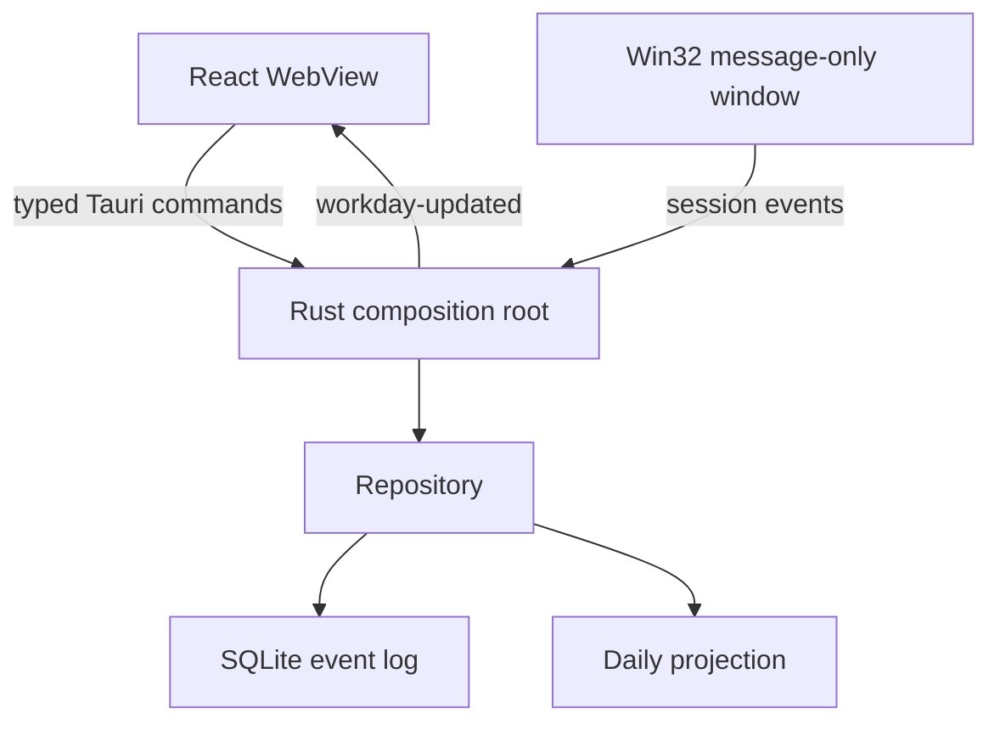

# Architecture

Tài liệu này giải thích cách React, Tauri và Rust ghép lại với nhau. Mục tiêu là giúp một developer chưa dùng Tauri/Rust có thể lần theo request từ UI tới Windows API và SQLite.

## Runtime topology



Tauri không chạy một HTTP backend. `invoke()` dùng Tauri IPC nằm trong process. Production app không mở local server hoặc network port.

## Layer responsibilities

### React (`src/`)

React chỉ:

- gọi commands;
- render dashboard/history;
- gửi thay đổi autostart;
- listen event `workday-updated` rồi reload read model.

React không biết schema SQLite và không được arbitrary filesystem/shell permission. Điều này tránh việc presentation code phá invariants của tracking core.

### Composition root (`src-tauri/src/lib.rs`)

File này nối các adapter:

- khởi tạo Tauri plugins;
- tạo database trong `app_local_data_dir`;
- đăng ký commands;
- tạo tray;
- khởi động Windows session monitor;
- chạy projection timer mỗi phút.

Đây là nơi dependency wiring diễn ra, không phải nơi đặt SQL hoặc domain rules.

### Domain (`domain.rs`)

Domain định nghĩa event vocabulary và DTO trả cho UI. `Occurrence` giữ đồng thời:

- `utc_ms` để tính duration ổn định;
- `local_date` để group theo ngày mà người dùng nhìn thấy;
- `offset_seconds` để raw event có đủ context khi audit.

### Repository (`repository.rs`)

Repository là owner duy nhất của SQLite connection. Mỗi raw event và projection update nằm trong cùng transaction.

Hai tables:

- `events`: append-only facts từ application/Windows lifecycle;
- `workdays`: derived projection để UI query đơn giản và nhanh.

Nếu heuristic thay đổi trong tương lai, có thể thêm migration để rebuild `workdays` từ `events`.

### Windows adapter (`windows_session.rs`)

Tauri không expose trực tiếp các `WM_WTSSESSION_CHANGE` message cần cho app. Adapter tạo một Win32 message-only window trên dedicated thread và đăng ký `WTSRegisterSessionNotification`.

Không subclass WebView window vì lifecycle của tracking không nên phụ thuộc vào window UI. Tất cả `unsafe` blocks đều nằm trong adapter này và có safety comment.

## IPC contract

React gọi:

```text
get_dashboard() -> Dashboard
set_autostart_enabled(enabled: boolean) -> void
```

Rust phát:

```text
workday-updated
```

Command trả `Result<T, String>` để Tauri serialize error rõ ràng. Internal Rust errors không làm crash React.

## Threading model

- Tauri main thread quản lý native UI/tray.
- Win32 monitor thread sở hữu message-only window và message loop.
- Callback thread chuyển event vào repository qua `Mutex`.
- Projection timer thread thức mỗi 60 giây.
- SQLite `busy_timeout` là 5 giây và WAL giảm contention khi đọc/ghi.

Repository operations ngắn và synchronous. Với workload một event mỗi vài phút, async database layer chỉ tăng complexity mà không tạo lợi ích thực tế.

## Security boundaries

- Không network plugin.
- Không shell plugin.
- Không frontend filesystem permission.
- React không truy cập SQLite trực tiếp.
- Autostart được điều khiển từ Rust.
- CSP chỉ cho local assets và Tauri IPC.
- App chạy dưới quyền user hiện tại, không elevation.

## Dependency policy

- Chỉ latest stable versions tại thời điểm scaffold.
- `package-lock.json` và `Cargo.lock` được commit.
- CI dùng `npm ci` và Cargo `--locked`.
- Dependabot đề xuất update hằng tuần; không auto-merge.
- Node dùng latest LTS thay vì Current release để phù hợp production guidance.

