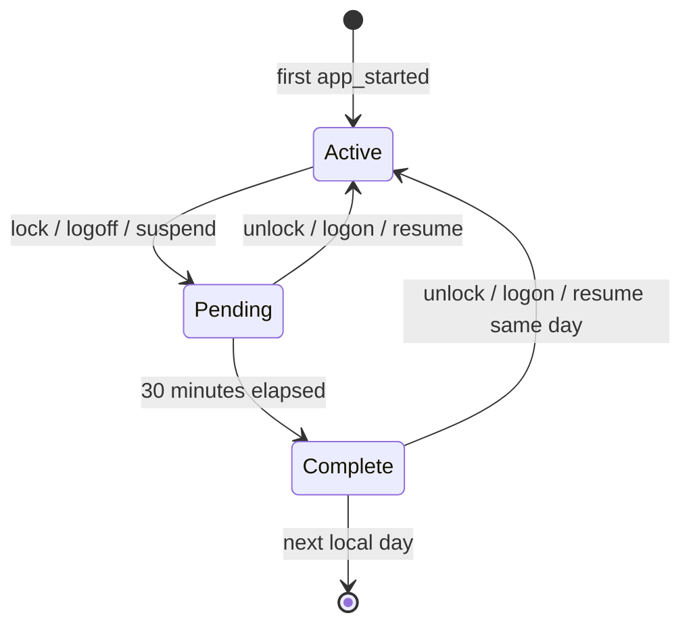

# Tracking state machine

## Mục tiêu

Windows không có event “người dùng đã rời công ty”. App chỉ quan sát laptop session, do đó tracking là một heuristic có thể giải thích và audit.

## Events

| Raw event | Nguồn | Ý nghĩa trong projection |
|---|---|---|
| `app_started` | Tauri startup | Present; tạo arrival nếu là event đầu ngày |
| `session_logon` | WTS | Present |
| `session_unlock` | WTS | Present; hủy departure candidate |
| `session_lock` | WTS | Away; tạo candidate |
| `session_logoff` | WTS | Away; tạo candidate |
| `system_suspend` | Power broadcast | Away; tạo candidate |
| `system_resume` | Power broadcast | Present; hủy candidate |
| `system_shutdown` | End-session message | Away; persist trước khi process dừng |

## State transitions



`Complete -> Active` là intentional. Ví dụ bạn lock laptop 45 phút để họp rồi quay lại: UI có thể tạm xem lock là departure, nhưng unlock chứng minh candidate đó sai và projection phải được sửa.

## Invariants

1. Một local date chỉ có một workday projection.
2. Arrival là present event đầu tiên trong ngày và không bị overwrite.
3. Departure không sớm hơn arrival.
4. Present event cùng ngày luôn clear pending/final departure.
5. Candidate cũ của ngày trước chỉ được finalize khi đã đủ grace period; đổi ngày không bỏ qua rule 30 phút.
6. Raw events không update/delete trong MVP.

## Shutdown và grace period

Process không thể tiếp tục chạy 30 phút sau shutdown. Khi nhận `WM_QUERYENDSESSION`, app ghi `system_shutdown` và candidate vào SQLite ngay lập tức nhưng vẫn cho Windows shutdown tiếp tục.

Ở lần chạy sau:

- nếu local date đã đổi, candidate ngày trước được finalize;
- nếu vẫn cùng ngày, `app_started` là bằng chứng user quay lại và candidate bị hủy.

## Time handling

Mỗi event lưu UTC milliseconds và local offset. Duration dùng UTC:

```text
duration = max(0, effective_end_utc - arrival_utc)
```

Grouping dùng `local_date` tại thời điểm event. Điều này tránh duration âm/sai khi DST thay đổi, nhưng nếu user đổi timezone giữa ngày thì các event có thể nằm ở hai local dates. Đây là accepted limitation của MVP.

## Failure modes

| Failure | Kết quả | Biện pháp hiện tại |
|---|---|---|
| Company policy chặn autostart | Không có arrival tự động | UI hiển thị setting; user/IT xử lý policy |
| App bị force-kill trước khi nhận session event | Event cuối có thể thiếu | Event log không thể suy ra fact chưa quan sát |
| SQLite đang bận | Write đợi tối đa 5 giây | WAL + `busy_timeout` |
| Login ở ngoài công ty | False arrival | Accepted MVP limitation |
| Lock để họp trên 30 phút | Temporary false departure | Unlock cùng ngày mở lại projection |
| App mở hai lần | Race/duplicate event | Single-instance plugin |
